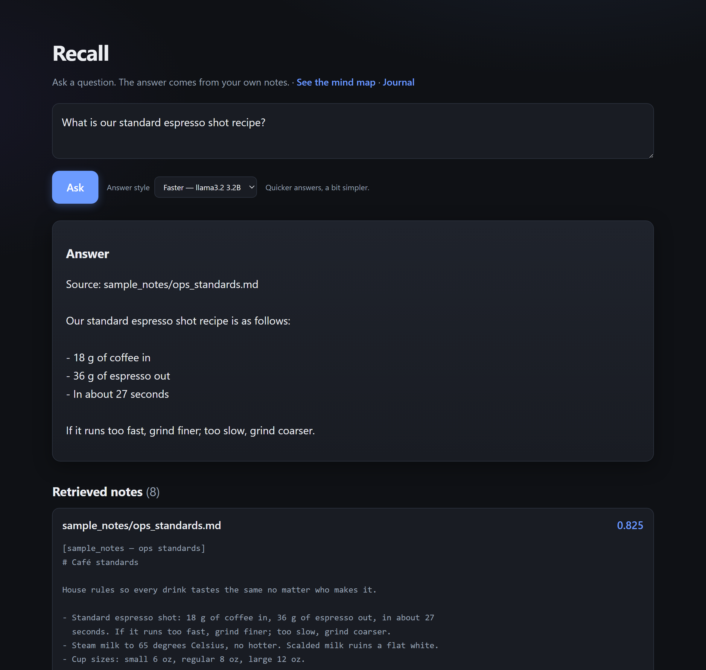

# Recall — a local RAG app over your own notes, with an eval suite

Ask a plain-English question, get an answer grounded in your own notes, with the
source note named. Everything runs on your machine. Your notes never leave it.

Recall is a small but complete example of a **production-minded RAG system**:
hybrid retrieval, a tool-calling agent over notes *and* live numbers, a local or
cloud answer model, and **automated eval suites** that score how good the answers
are. It is built to be read, not just run.

> This public repo ships with a **fictional** sample note set — the working notes
> of a made-up café and coffee-roastery owner ("Sam Carter") — so it runs out of
> the box with no private data. Point it at your own note folders to use it for real.



---

## What this project demonstrates

The things AI-engineering roles actually screen for, in one small codebase:

- **RAG (retrieval-augmented generation).** Notes are chunked, embedded, and
  searched, then the top chunks are handed to a model to answer from.
- **Hybrid search.** Meaning search (embeddings) and exact-word search (SQLite
  FTS5, BM25) run side by side and are merged with Reciprocal Rank Fusion, so an
  exact supplier name, date or code is not blurred away by meaning search.
- **Measured "no"s.** Cross-encoder reranking is built in but switched off: it
  was tested and did not earn its cost (see Results).
- **Local-first, private.** Embeddings (fastembed / `bge-small`) and generation
  (Ollama / `llama3.2:3b`) both run on-device. A cloud model (Claude) is a
  config switch, not a requirement.
- **A tool-calling agent.** `agent.py` decides per question whether it needs the
  notes (`search_notes`), live numbers (`cafe_tools.py`), or both, and the web
  page shows each step live. It carries code-level guards for three real failure
  modes its own eval caught (see Results).
- **Evals as a first-class citizen.** A golden question set, a scorer for both
  retrieval and answer accuracy, and an LLM-as-judge pass. This is the part that
  separates a demo from something you would trust.
- **Readable engineering.** Every module is commented in plain language, config
  is centralised, and the DB is a single SQLite file.

## How it works, in one picture

```
your question
   -> embed the question into 384 numbers (bge-small, local)
   -> compare against every stored note chunk (cosine similarity)  = meaning list
   -> word-search the same chunks (SQLite FTS5, BM25)              = words list
   -> merge the two lists by rank (Reciprocal Rank Fusion)
   -> take the top chunks
   -> hand them to the answer model with the question
   -> model answers using only those chunks, and cites the source note
```

Three moving parts:

1. **Ingest** (`ingest.py`) — read notes, cut into chunks, embed, save to SQLite.
2. **Retrieve** (`rag.py`) — hybrid search: meaning + exact words, merged by rank.
3. **Generate** (`rag.py`) — the model writes the answer from those chunks.

## Results

Reproduce these on your machine with the commands under "Run the evals". All runs
are local (`llama3.2:3b` answers, `qwen2.5:7b` agent) on the bundled fictional
café data.

**Search + answers** (`evals/run_eval.py`, 24 questions, 8 of them testing exact
names, dates and codes):

| Metric | Score |
|---|---|
| Retrieval hit rate (right note pulled in) | **24/24 (100%)** |
| Right note in the top 3 | **24/24** |
| Rank score (MRR, 1.000 = right note always first) | **1.000** |
| Answer pass rate (all required facts present) | **24/24 (100%)** |

**The agent** (`evals/agent_eval.py`, 9 questions: 3 notes-only, 3 numbers-only,
3 needing both):

| Metric | Score |
|---|---|
| Overall pass (right tools, right facts, grounded numbers) | **9/9** |
| Routing (called every tool the question needs) | **9/9** |
| Grounded numbers (figures match what a tool returned) | **6/6** |

The agent's first café run scored **7/9**: twice it described the notes without
having searched them. Both were fixed with code-level guards, not prompt wording.
The story of every failure the quiz caught is in
[`docs/what-my-evals-caught.md`](docs/what-my-evals-caught.md).

**Why the search scores are perfect, and why that proves less than it looks.**
The demo corpus is 16 short, clean notes, so meaning-only and hybrid search both
score 24/24 here: there is nothing for exact-word search to rescue. A perfect
demo score means the pipeline is wired correctly end to end; a larger, messier
note set is where the numbers move, so point it at your own notes and re-run the
eval to see what hybrid search does there.

Each eval writes a timestamped report to `evals/reports/`, so you can see whether
a change made a score go up or down. See [`evals/README.md`](evals/README.md).

## Run it yourself

Requires Python 3.12 and (for local answers) [Ollama](https://ollama.com).

```bash
py -3.12 -m venv venv
venv\Scripts\activate
pip install -r requirements.txt

python ingest.py        # build the index from sample_notes/ (first run downloads bge-small, ~130 MB)
python app.py           # open http://127.0.0.1:5170
```

Prefer no local model? Set `GEN_BACKEND = "none"` in `config.py` to see retrieval
only, or `"anthropic"` with an `ANTHROPIC_API_KEY` to answer with Claude.

## Run the evals

```bash
python evals/run_eval.py                  # retrieval + answer
python evals/run_eval.py --retrieval-only # fast, no answer model needed
python evals/agent_eval.py                # the agent: routing, facts, grounded numbers
```

Ask the agent directly:

```bash
python agent.py "How much is in the emergency fund now, and what is my target?"
```

On the web page, pick **Mode: Notes + live numbers** to use the agent; each step
("Searched your notes for ...", "Looked up the café's cash and fund balances")
appears as it happens, then the answer and the notes it read.

## Repo layout

| Path | What it is |
|---|---|
| `ingest.py`, `indexer.py` | build and update the search index |
| `rag.py` | retrieval + answer generation (the core) |
| `agent.py` | the agent: notes + number tools in one tool-calling loop |
| `cafe_tools.py`, `sample_data/` | read-only number tools over FICTIONAL café figures |
| `app.py`, `templates/`, `static/` | the Flask web page |
| `evals/` | golden set, scorer, LLM-as-judge, reports |
| `sample_notes/` | the fictional demo corpus (notes) |
| `config.py` | every setting in one place |

## Use it on your own notes

Edit `CORPUS_FOLDERS` in `config.py` to point at your own folders of `.md` notes,
set `USER_NAME`, and re-run `python ingest.py`. Your notes stay local and are
gitignored by default.

## Design notes on privacy

Retrieval always runs locally. With the default Ollama backend, generation is
local too, so a question and its answer never leave the machine. The built index
(`data/`) and any notes you type in (`my_notes/`) are gitignored, so a personal
deployment never commits private content.

## Write-ups

- [How I built Recall](docs/how-i-built-recall.md): the RAG app and its first eval suite.
- [What my evals caught](docs/what-my-evals-caught.md): hybrid search, the agent,
  and the four ways the quiz caught it making things up.

## License

MIT. See [LICENSE](LICENSE).
